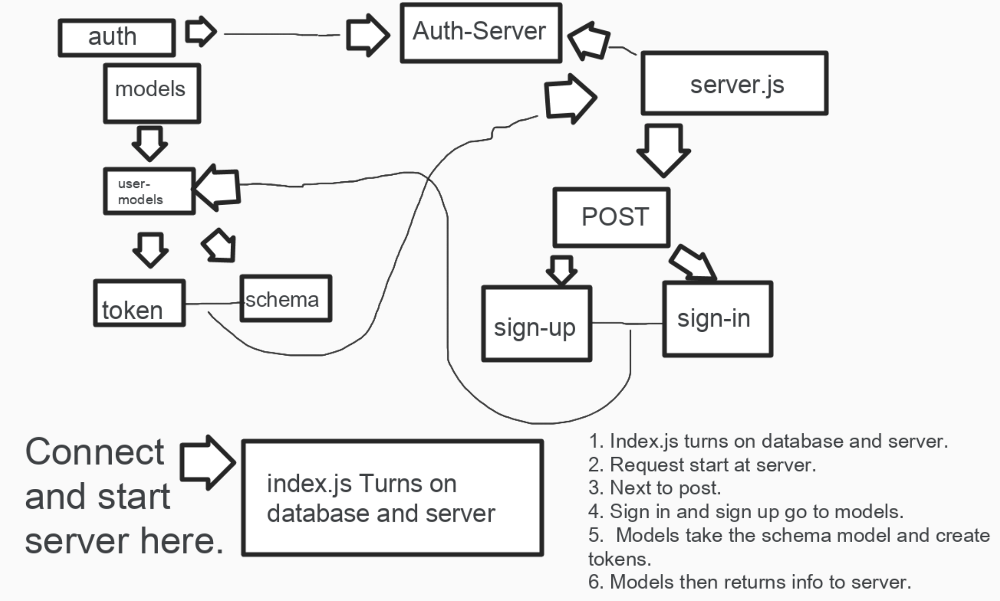

# Lab class-14
## Project: Lab 14 - ACL

### Author: Edgar Romero.

### Links and Resources

ci/cd (GitHub Actions)
back-end server url (when applicable)
front-end application (when applicable)

### Setup

.env requirements (where applicable)

i.e.

PORT - Port Number
MONGODB_URI - URL to the running mongo instance/db

### Dependencies:
```
@code-fellows/supergoose": "^1.0.11",
   "base-64": "^0.1.0",
    "bcrypt": "^5.0.0",
    "dotenv": "^8.2.0",
    "express": "^4.17.1",
    "jsonwebtoken": "^8.5.1",
    "mongoose": "^5.10.5"
```
### How to initialize/run your application (where applicable)
To start the application run the following command:
`npm start`


### How to use your library (where applicable)
Tests are handled with the jest testing library. Install jest to the dev dependencies. Follow the command:

`npm i --save-dev jest`

Then run:

`npm test`  follow by the name of the file to test.


### UML


